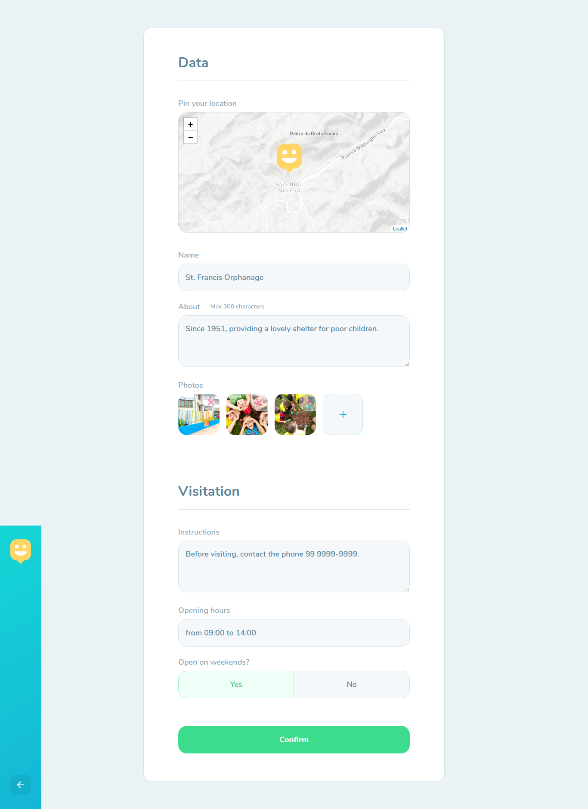

<h1 align="center">
  
</h1>
<p align="center">
  
  
  
  
  <a href="https://github.com/maiquelp/happy/commits/master">
    
  
  </a>
  <!--  -->
 <br>
  <a href="https://www.linkedin.com/in/maiquelp/">
      
  </a> 
  <!-- <a href="https://insomnia.rest/run/?label=happy&amp;uri=https%3A%2F%2Fraw.githubusercontent.com%2maiquelp%2Fhappy%2Fmaster%2F.github%2FInsomnia.json" target="_blank"></a> -->
</p>
<strong>
<br>
<p align="center">
    <a href="README.md">English</a>
    ·
    <a href="README-pt.md">Portuguese</a>
</p>

<p align="center">
  <a href="#bookmark-about">About</a>&nbsp;&nbsp;&nbsp;|&nbsp;&nbsp;&nbsp;
  <a href="#computer-technologies">Technologies</a>&nbsp;&nbsp;&nbsp;|&nbsp;&nbsp;&nbsp;
  <a href="#wrench-tools">Tools</a>&nbsp;&nbsp;&nbsp;|&nbsp;&nbsp;&nbsp;
  <a href="#package-installation">Installation</a>&nbsp;&nbsp;&nbsp;|&nbsp;&nbsp;&nbsp;<a href="#camera_flash-screenshots">Screenshots</a>&nbsp;&nbsp;&nbsp;|&nbsp;&nbsp;&nbsp;
  <a href="#memo-license">License</a>
</p>
</strong>
<br>

<p align="center">
    
</p>

## :bookmark: About

**happy** is a platform to link children care institutions with people interested in help. This project was implemented during the **Next Level Week #3** of **[Rocketseat](https://rocketseat.com.br/)**.

<br>

## :computer: Technologies

-  **[Typescript](https://www.typescriptlang.org/)**
-  **[Node.js](https://nodejs.org/)**
-  **[Express](https://expressjs.com/)**
-  **[TypeORM](https://typeorm.io/)**
-  **[SQLite](https://www.sqlite.org/)**
-  **[ReactJS](https://reactjs.org/)**
-  **[React Native](http://facebook.github.io/react-native/)**
-  **[Expo](https://expo.io/)**
-  **[Axios](https://github.com/axios/axios)**

<br>

## :wrench: Tools

- **[VisualStudio Code](https://code.visualstudio.com/)**
- **[Insomnia](https://insomnia.rest/)**
- **[Google Chrome](https://www.google.com/chrome/)**
- **[DBeaver](https://dbeaver.io/)**

<br>

## :package: Installation

### :heavy_check_mark: **Prerequisites**

The following software must be installed:
  
  - **[Node.js](https://nodejs.org/en/)**
  - **[Git](https://git-scm.com/)**
  - **[NPM](https://www.npmjs.com/)** or **[Yarn](https://yarnpkg.com/)**
  - **[Expo](https://expo.io/)** 
  - **[Expo App](https://play.google.com/store/apps/details?id=host.exp.exponent)**

<br>
  
### :arrow_down: **Cloning the repository**

```sh
  $ git clone https://github.com/maiquelp/happy.git
```

<br>

### :arrow_forward:	**Running the applications**

- :package: API

```sh
  $ cd backend
  # Dependencies install.
  $ yarn # or npm install
  # Data base creation.
  $ yarn typeorm migration:run # or npm run typeorm migration:run
  # API start
  $ yarn dev # or npm run dev
```

- :computer: Web app

```sh
  $ cd web
  # Dependencies install.
  $ yarn # or npm install
  # Running web app
  $ yarn start # or npm start
```

- :iphone: Mobile app

```sh
  $ cd mobile
  # Dependencies install.
  $ yarn # or npm install
  # Running mobile app
  $ yarn start # or npm start
```

<br>

## :camera_flash: Screenshots

- Web





- Mobile


<br>

## :memo: License

This project is under the **MIT** license.


